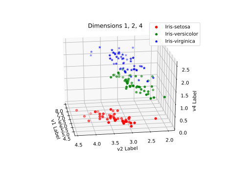
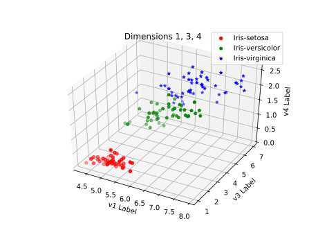

```python
import pandas
from mpl_toolkits.mplot3d import Axes3D
import matplotlib.pyplot as plt
import numpy as np

IRIS_FILENAME = 'iris-dataset.csv'

def draw_dimensions(iris_dat, plt, d1, d2, d3,
                    COLOURS='rgbycmk',
                    MARKERS='op*<>^1234shH+xDd|_'):
    fig = plt.figure()
    ax = fig.add_subplot(111, projection='3d')
    d1s, d2s, d3s = 'v{}'.format(d1), 'v{}'.format(d2), 'v{}'.format(d3)

    for (t, dat), c, m in zip(iris_by_types.items(), COLOURS, MARKERS):
        ax.scatter(dat[d1s], dat[d2s], dat[d3s],
                   label=t, c=c, marker=m)

    ax.legend()
    ax.set_title('Dimensions {}, {}, {}'.format(d1, d2, d3))
    ax.set_xlabel('{} Label'.format(d1s))
    ax.set_ylabel('{} Label'.format(d2s))
    ax.set_zlabel('{} Label'.format(d3s))

    plt.show()

if __name__ == '__main__':
    iris_dat = pandas.read_csv(IRIS_FILENAME,
                               names=['v1', 'v2', 'v3', 'v4',
                                      'label'],
                               index_col=False)
    types = iris_dat['label'].unique()
    iris_by_types = {t: iris_dat.loc[iris_dat['label'] == t]
                     for t in types}

    draw_dimensions(iris_dat, plt, 1, 2, 3)
    draw_dimensions(iris_dat, plt, 1, 2, 4)
    draw_dimensions(iris_dat, plt, 1, 3, 4)
    draw_dimensions(iris_dat, plt, 2, 3, 4)
```
