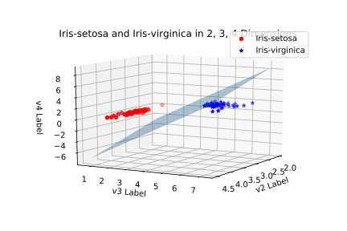

```python
import pandas as pd
from mpl_toolkits.mplot3d import Axes3D
import matplotlib.pyplot as plt
import numpy as np
from sklearn.svm import LinearSVC
IRIS_FILENAME = 'iris-dataset.csv'
%matplotlib tk

iris_dat = pd.read_csv(IRIS_FILENAME, names=['v1', 'v2', 'v3', 'v4', 'label'], index_col=False)
types = iris_dat['label'].unique()
iris_by_types = {t: iris_dat.loc[iris_dat['label'] == t] for t in types}
iris_d234 = iris_dat.loc[:, ['v2', 'v3', 'v4', 'label']]

iris_d234_bytypes = {t: iris_d234.loc[iris_d234['label'] == t] for t in iris_d234['label'].unique()}

fig = plt.figure()
ax = fig.add_subplot(111, projection='3d')

def draw_iris_d234_sv(ax):
    dat = iris_d234_bytypes['Iris-setosa']
    ax.scatter(dat['v2'], dat['v3'], dat['v4'], label=dat['label'].unique()[0], c='r', marker='o')
    dat = iris_d234_bytypes['Iris-virginica']
    ax.scatter(dat['v2'], dat['v3'], dat['v4'], label=dat['label'].unique()[0], c='b', marker='*')

    ax.legend()
    ax.set_title('Iris-setosa and Iris-virginica in 2, 3, 4 Dimensions')
    ax.set_xlabel('v2 Label')
    ax.set_ylabel('v3 Label')
    ax.set_zlabel('v4 Label')

draw_iris_d234_sv(ax)

dat = iris_d234_bytypes['Iris-setosa']
dat = dat.append(iris_d234_bytypes['Iris-virginica'], ignore_index=True)
X = dat.loc[:, ['v2', 'v3', 'v4']]
Y = pd.DataFrame(dat['label'])

MAP = {'Iris-setosa': -1, 'Iris-virginica': 1}
for i in range(len(Y)):
    Y.loc[i, 'label'] = MAP[Y.loc[i, 'label']]

clf = LinearSVC(random_state=0)
clf.fit(X, np.array(Y.loc[:, 'label'].T))

def draw_plane(coef, ax):
    """
    v1x + v2y + v3z = 0
    z = 1/v3 (-v1x  -v2y)
      = 1/v3 [(-v1 -v2) (x y)T]
    """
    xlim, ylim, zlim = ax.get_xlim(), ax.get_ylim(), ax.get_zlim()
    X = np.linspace(xlim[0], xlim[1], 30)
    Y = np.linspace(ylim[0], ylim[1], 30)
    X, Y = np.meshgrid(X, Y)
    Xr, Yr = X.ravel(), Y.ravel()
    XY = np.vstack([Xr, Yr]).T
    XY = np.array([np.matrix(m).T for m in XY])
    
    [v1, v2, v3] = list(coef[0])
    A = np.matrix([v1, v2])
    Z = 1/v3*np.array([A*XYi for XYi in XY])
    Z = Z.reshape(X.shape)
    
    ax.plot_surface(X, Y, Z, alpha=0.4)

draw_plane(clf.coef_, ax)
```
